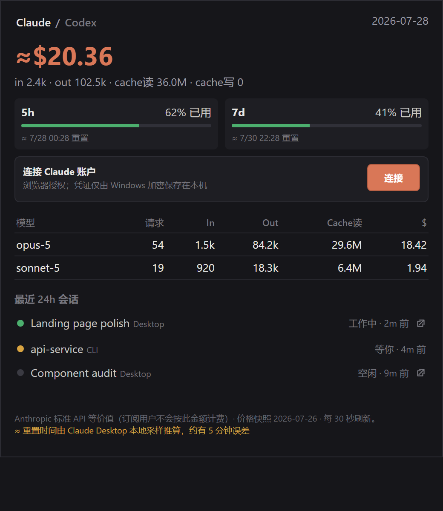

<p align="center">
  
</p>

<h1 align="center">AI Code Usage Tray</h1>

<p align="center">
  一个轻量、本地优先的 Windows 托盘监视器，同时查看 Claude Code / Desktop 与 Codex CLI / Desktop 的用量、额度和会话状态。
</p>

<p align="center">
  <a href="https://github.com/saime428/ai-code-usage-tray/releases/latest"><strong>下载最新 Windows 便携版</strong></a>
  · <a href="#快速开始">快速开始</a>
  · <a href="#本地开发">开发指南</a>
  · <a href="#english">English</a>
</p>

<p align="center">
  
</p>

> [!NOTE]
> 面板中的金额是按官方标准 API 价格计算的**等价价值**，用于观察消耗速度；Claude / Codex 订阅用户不会按该金额再次扣费。

## 亮点

| | |
| --- | --- |
| **Claude + Codex 一处查看** | 同时聚合 Claude Code、Claude Desktop、Codex CLI 和 Codex Desktop。 |
| **额度窗口** | 显示可用的 5h / 7d 使用比例、重置时间和数据新鲜度。 |
| **会话状态** | 区分工作中、等你、需处理和空闲；Desktop 会话可从面板打开。 |
| **贴边悬浮条** | 顶部或右侧常驻，悬停展开；全屏应用前自动隐藏。 |
| **本地优先** | 默认只读取本机客户端已产生的数据，不上传提示词或会话内容。 |
| **零 API Key** | 本地模式无需 API Key；Claude OAuth 只是可选的精确额度来源。 |

## 快速开始

1. 打开 [GitHub Releases](https://github.com/saime428/ai-code-usage-tray/releases/latest)。
2. 下载 `AI-Code-Usage-Tray-*-win-x64.exe`。
3. 双击运行，无需安装；单击悬浮条或系统托盘图标打开完整面板。
4. 右键悬浮条或托盘图标，可刷新、切换顶部/右侧、隐藏悬浮条或退出。

> [!WARNING]
> v1.0.1 及更早版本尚未进行 Windows 代码签名，SmartScreen 可能显示提醒。请只从本仓库的 Releases 下载，并核对 Release 中提供的 SHA-256。后续签名版本将按下方 [Code signing policy](#code-signing-policy) 发布。

## 数据从哪里来

| 客户端 | 本地来源 | 可提供的数据 |
| --- | --- | --- |
| Claude Code | `~/.claude/projects/**/*.jsonl` | token、模型、项目、会话活动 |
| Claude Desktop | `%APPDATA%/Claude/plan-usage-history.json` | 5h / 7d 百分比 |
| Claude Desktop | `%APPDATA%/Claude/claude-code-sessions/**/*.json` | 标题、客户端类型、最近活动 |
| Claude 账户（可选） | Anthropic OAuth 用量接口 | 官方百分比与精确重置时间 |
| Codex CLI / Desktop | `~/.codex/sessions/**/*.jsonl` | token、额度窗口、模型、会话活动 |

### 重置时间与刷新频率

- 应用每 **30 秒**重新读取一次本地数据。
- Claude Desktop 自己通常约每 **5 分钟**写入一次额度采样，所以界面显示的是“Desktop N 分钟前采样”。
- Claude Desktop 本地历史不保存 `resets_at`。应用会根据最近一次归零与下一次采样推算重置时间，并用 **`≈`** 标记，通常约有 5 分钟误差。
- 可选 Claude OAuth 成功后，会自动优先使用官方精确重置时间。凭证只通过 Windows `safeStorage` 加密保存在本应用数据目录，点击“断开”即删除。

### 会话状态

| 颜色 | 状态 | 含义 |
| --- | --- | --- |
| 🟢 | 工作中 | 最近仍在产生输出或写入会话 |
| 🟡 | 等你 | 当前轮次完成，等待下一条输入 |
| 🔴 | 需处理 | 权限确认或其他需要人工操作的事件 |
| ⚫ | 空闲 | 最近没有活动 |

Claude CLI 配置 hooks 时可获得更准确的 waiting / attention 状态；没有 hook 时使用会话写入时间回退。新写入的 transcript 会覆盖过期 hook，避免正在运行时仍显示旧的“等你”。

## 隐私与安全

- 不上传 transcript、提示词、项目路径或会话标题。
- 不读取浏览器 Cookie，不要求 Anthropic / OpenAI API Key。
- 本地文件损坏、被锁定或权限不足时保留上一份快照，并明确标为过期。
- OAuth 登录为可选功能；网络或 Anthropic 限流失败时，本地用量监控仍可继续工作。
- 完整说明见 [Privacy Policy](PRIVACY.md)。

## Code signing policy

- Free code signing provided by [SignPath.io](https://about.signpath.io), certificate by [SignPath Foundation](https://signpath.org).
- SignPath-signed releases will be built from this repository by [GitHub Actions](.github/workflows/ci.yml) and manually approved before signing. v1.0.1 and earlier remain unsigned.
- Committer, reviewer, and approver: [@saime428](https://github.com/saime428).
- Privacy policy: [PRIVACY.md](PRIVACY.md).

## 本地开发

需要 **Windows 10/11、Node.js 22+ 和 npm**：

```powershell
git clone https://github.com/saime428/ai-code-usage-tray.git
cd ai-code-usage-tray
npm ci
npm test
npm start
```

生成 Windows x64 便携版：

```powershell
npm run dist
```

产物位于 `dist/AI-Code-Usage-Tray-<version>-win-x64.exe`。

### 项目结构

```text
main.js                 Electron 主进程、托盘、窗口与刷新调度
preload.js              受限 IPC bridge
lib/usage.js            Claude 本地用量与会话解析
lib/codex-usage.js      Codex 本地用量与额度解析
lib/claude-oauth.js     可选 Claude OAuth / PKCE
renderer/index.html     完整面板
renderer/floating.html  贴边悬浮条
hooks/                   可选 Claude Code 状态 hooks
```

### 发布检查

```powershell
npm test
npm run dist
git status --short
```

更新 `package.json` 版本，在干净 Windows 环境启动便携版，再创建 GitHub Release 并上传 `.exe` 与 SHA-256。

## 当前限制

- Windows x64 only。
- 尚未接入自动更新。
- v1.0.1 及更早版本尚未进行代码签名；SignPath Foundation 申请和自动签名接入正在进行。
- Claude OAuth 可能受 Anthropic 限流或当前网络出口影响；本地推算不受影响。

## 贡献

Issue 和 Pull Request 都欢迎。提交前请运行：

```powershell
npm test
```

如果新增非平凡解析逻辑，请补一个能覆盖真实格式的小测试；不要提交 transcript、凭证或个人项目路径。

<a id="english"></a>
## English

**AI Code Usage Tray** is a local-first Windows tray monitor for Claude Code/Desktop and Codex CLI/Desktop. It shows daily tokens, API-equivalent value, available 5-hour / 7-day rate-limit windows, reset times, and recent session activity without uploading transcript contents or requiring API keys.

Download the portable x64 executable from [GitHub Releases](https://github.com/saime428/ai-code-usage-tray/releases/latest), or clone the repository and run `npm ci`, `npm test`, and `npm start`. See the [Privacy Policy](PRIVACY.md) and [Code signing policy](#code-signing-policy).

## License

[MIT](LICENSE) © 2026 saixin

---

<p align="center">
  Not affiliated with or endorsed by Anthropic or OpenAI.
</p>
