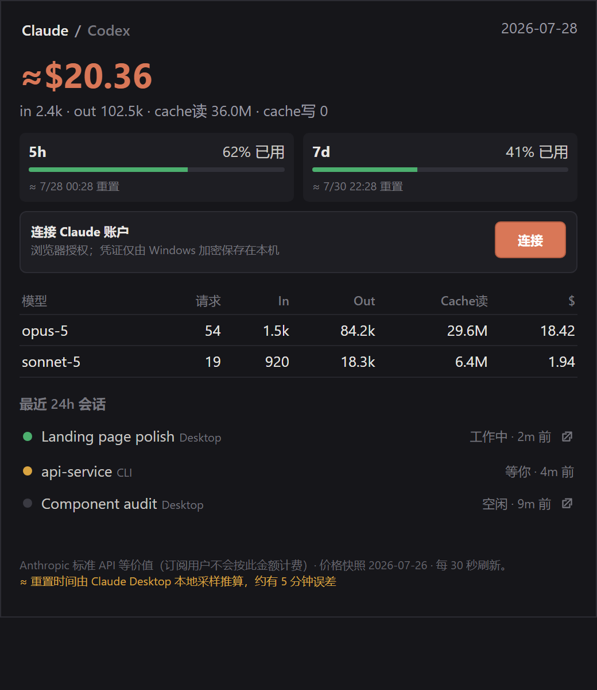

<p align="center">
  
</p>

<h1 align="center">AI Code Usage Tray</h1>

<p align="center">
  本地优先的 Windows 托盘监视器，用来查看 Claude Code / Desktop、Codex CLI / Desktop、Grok CLI、Antigravity 和 OpenCode 的用量、额度、账号和会话状态，并提供跨工具的用量报表。
</p>

<p align="center">
  <a href="README.md">English</a> | 简体中文
</p>

<p align="center">
  <a href="https://github.com/saime428/ai-code-usage-tray/releases/latest"><strong>下载最新 Windows 版</strong></a>
  · <a href="#快速开始">快速开始</a>
  · <a href="#本地开发">开发指南</a>
</p>

<p align="center">
  
</p>

> [!NOTE]
> 面板里 Claude / Codex / Antigravity 的金额是按官方标准 API 价格计算的**等价值**（价格表会从本仓库自动更新，日期显示在面板底部），用来对照消耗快慢，订阅不会按这个金额扣费。Grok 的金额来自 Grok CLI 记录的官方结算值，订阅额度内同样不会另外扣费。OpenCode 的金额是 OpenCode 自己给每条消息记下的值。
>
> Claude Desktop 的普通 Home 聊天，本机只有会话元数据和额度百分比，没有精确 token 明细，所以算不出金额。金额只统计本地有 transcript 的 Claude Code / Cowork 会话。连接 Claude 账户只会让额度和重置时间更准，补不齐 Home 聊天的 token。

## 亮点

| | |
| --- | --- |
| **五个工具一处查看** | Claude Code、Claude Desktop、Codex CLI/Desktop、Grok CLI、Antigravity（IDE 和 CLI）和 OpenCode 放在同一面板。Antigravity、OpenCode 的页签在本机有数据时才出现。 |
| **用量报表** | 一个可调大小的报表窗口，覆盖所有工具：日趋势、时段分布、按工具、按项目、最贵的会话和按模型，并和上一周期对比。命令行也能看。 |
| **独立日期范围** | 每个来源可以各自选最近 1–90 天，互不影响。 |
| **额度窗口** | 显示 5h / 7d 使用比例、重置时间和数据更新时间。连上 Claude 账户后，有数据也会显示 Fable 窗口；Antigravity 开着时，也显示它的 Gemini 和 Claude/GPT 额度。 |
| **分账号用量** | 从本机启用分账号统计后，按当前账号累计 Token，更早的记录不计在内。账本由 Windows 加密保存在本地。 |
| **会话状态** | 区分工作中、需处理和空闲。Desktop 会话可以从面板打开。 |
| **任务流光环** | 有会话在跑时，悬浮条上那一家会绕一圈流动的光；监听会话目录的写入，不等 30 秒刷新。样式可换成彩虹或关掉。 |
| **贴边悬浮条** | 可贴在屏幕顶部或右侧，悬停展开，显示哪几家可以自己选（默认是本机检测到的）；全屏应用（独占或无边框全屏的游戏、视频、演示）时自动隐藏，可在托盘菜单关闭该行为。 |
| **本地优先** | 只读本机客户端已经写下的数据，不上传任何关于你的信息。不连接 Claude 账户的话，唯一的自动请求是从本仓库下载公开的价格表。 |
| **价格自动跟进** | 新型号和改价在这里修正后一天内生效，不用装新版。托盘菜单可以关掉。 |
| **零 API Key** | 本地模式不需要 API Key。Claude OAuth 是可选项，用来读更准的额度。 |

## 最新更新

### v1.7.2

- **托盘图标改成每家一格，还能告诉你哪家跑完了**。它以前是一个方块：任何会话最近两分钟写过盘就绿，否则陶土色，Claude 弹权限确认时红。它跟的是 30 秒刷新，比悬浮条的流光环最多晚两分半；开自动模式跑 agent 的人只会见到陶土色和绿色。现在悬浮条显示几家，它就分几格，顺序和悬浮条一样：灰是空闲，蓝是在跑，绿是跑完了你还没看，红是需要你。它和流光环用同一路信号，一秒内就有反应。绿格在你打开或关上面板、那一家又开始跑、或者过了 10 分钟时变回灰色。鼠标悬停时每格一行。见[托盘图标](#托盘图标)。
- **Codex 和 Grok 的流光环在模型长时间思考时不再熄灭**。以前最后一次写盘 20 秒后就灭，模型想一分钟，环就灭了。现在和 Antigravity 一样看各家自己的回合标记。作者本机所有 Codex、Grok 日志逐行回放过：没有一次把还在跑的一轮判成结束。见[任务在跑时的流光环](#任务在跑时的流光环)。

### v1.7.1

- **Antigravity 和 OpenCode 也有流光环了**。它们干活时悬浮条上那一格会亮起：Antigravity 粉、OpenCode 紫。Antigravity 的环看它的逐步转录，所以模型长时间思考、工具长时间运行时一直亮着，直到最终回答写完或你点了停止，约 20 秒后熄灭；本应用启动时已经在跑的那一轮也能认出来。OpenCode 的环看它数据库的写入，这条还没在真实的 OpenCode 会话上试过。见[任务在跑时的流光环](#任务在跑时的流光环)。

### v1.7.0

- **Antigravity 额度**。Antigravity 开着的时候，面板和悬浮条会显示它设置 → Models 页面上的那几个额度：Gemini 和 Claude/GPT 两组，各有 5 小时和每周窗口，带重置时间。Antigravity 只把额度放在正在运行的语言服务里，从不写到硬盘上，所以应用在 127.0.0.1 上向这个服务查询。它缓存的数不会跟着用量变，所以本机 Antigravity 一有新用量、某个窗口到了重置时间、以及每 10 分钟，应用会让它刷新一次：发完一条消息，悬浮条在一次 30 秒刷新内就会更新。Antigravity 关掉后保留最后一次的数，并标出是多久前的。见[数据从哪里来](#数据从哪里来)。
- **悬浮条显示哪几家可以自己选**。托盘或悬浮条右键 → 悬浮条显示：默认是本机检测到的工具，也可以在五家里随意勾选。Antigravity 和 OpenCode 现在也能放上悬浮条，用的是它们的官方标志。悬浮条按显示的家数和数字自己算尺寸，屏幕高度放不下展开的卡片时卡片区可以滚动。
- **修复：Claude Desktop 同一个对话的前几段被列成了单独的 CLI 会话**。对话因为上下文用完或回退而接着写进新转录文件时，Claude Desktop 会把之前的文件记在 `priorCliSessionIds` 里。这些旧文件对不上任何 Desktop 会话，会话列表就把它们当成同名的 CLI 会话列出来——作者本机 24h 列表 6 条里有 3 条是这种。现在它们归到这个对话名下：会话列表里一行、报表里一个会话，标题用 Desktop 的。金额逐分不变。

### v1.6.0

- **用量报表**。托盘菜单「打开用量报表」或面板上的「报表」按钮，打开一个覆盖所有工具的报表窗口：金额、Token、请求、会话和缓存命中率，并和上一周期对比；按天堆叠的趋势图（今日按小时）；一天里的时段分布；按工具；按项目——同一个目录下不同工具的用量合在一起，Claude Code 的 worktree 归回所在仓库；最贵的会话——子代理和 resume 复制过来的历史都记回真正跑它的会话；按模型。可以按工具筛选，图表可在金额和 Token 之间切换。见[用量报表](#用量报表)。
- **支持 Antigravity 和 OpenCode**。Antigravity 的 IDE 和 `agy` CLI 会话从它的本地数据库读取，按 Gemini API 价格算等价值（Antigravity 里用的 Claude 模型按 Claude 价）；OpenCode 显示它自己给每条消息记下的金额。两家都有面板页签、会话列表和报表数据。见[数据从哪里来](#数据从哪里来)。
- **只读新增的数据**。每次刷新只读会话文件自上次以来追加的字节，并且保留已读过的每一天，所以改统计天数、打开报表都不用重读文件。实测一个 38 MB 的会话文件追加一行，耗时 1–2 ms，整读要 75 ms。启动后的第一次统计仍是全量读。
- **修复：resume 过的 Claude 会话可能少算**。resume 或 fork 出来的新会话文件会复制一份之前的消息，其中可能有用量被清零的副本；这份副本恰好最后读到时，会顶掉真实的那份——作者本机 30 天少算 $0.24。现在每条消息按最完整的那份计，并归到最早创建的那个会话文件。
- **修复：Codex 子代理和 fork 出来的会话，多算少算都有**。fork 出来的 rollout——带父会话上下文的子代理、在 Codex Desktop 里 fork 的会话、自动审查代理——开头是一份来源会话历史的副本，这部分在来源那边已经计过费。应用以前把子代理最后一个 `thread_settings_applied` 事件当作副本的结束点；但在 Codex 0.153 及以后，这个事件多半是任务中途切换模型，于是子代理在切换之前自己做的工作被整段丢掉；而 Desktop fork 的会话、以及副本里跟在被复制的设置事件后面的那部分，又被算了第二遍。时间戳和设置事件都标不准副本（有些老版本的 fork 是整份一次写盘的，每一行都是创建时刻），但内容可以：复制来的调用，token 数和来源会话里的某次调用一模一样。现在 fork 出来的 rollout 会和它的来源、以及来源的来源逐条比对；`thread_settings_applied` 只用来确定模型（子代理常常只在这里写模型）。
- **修复：Codex 会话换到新文件之后的用量没有计入**。从 9 月底起，Codex 会把一个长会话接着写进 `rollout-<时间>-<会话id>_<uuid>.jsonl`。应用以前每个会话只认第一个文件，之后文件里的工作全被漏掉——作者本机最近 7 天约少了 30%。现在一个会话的所有文件都会计入，并且和它之前的文件按内容比对（续写文件有时会重放之前的调用）；会话列表的最后活动时间也取最新的那个文件。加上上一条修复，作者本机 Codex 金额：7 天从 $294 变为 $418，30 天从 $519 变为 $676，90 天从 $3,533 变为 $3,465（7 月 fork 被重复计的部分扣掉了）。
- **修复：`gpt-6.1-sol` 显示为 $0**。Codex 在上次核对价格后新上了这个型号，现在已按官方价补上。`npm run check-prices` 也会拿新增的 Gemini 价格和 Google 官方价格页比对。

### v1.5.0

- **价格表会自己更新**。价格表挪到了本仓库的 [`lib/prices.json`](lib/prices.json)，应用启动约 10 秒后和之后每天各下载一次，失败了每小时重试（开机自启时网络常常还没连上）。改价或新增型号推到这里，一天内就能到所有已安装的应用，不用装新版。下载的表必须校验通过、而且不比手上的旧才会用；联网失败时继续用上次下载的或应用内置的那份。请求不带任何关于你的信息，托盘菜单「自动更新价格表」可以关掉。见[金额是怎么算的](#金额是怎么算的)。
- **每周的价格检查改读官方页面**。`npm run check-prices` 现在逐项比对 Anthropic、OpenAI 官方价格页上的每个价格，并检查 Codex 模型页上可选的每个型号在表里都有行。GPT-6 Sol、Luna 在 1.4.0 之前一直算 0，就是因为旧检查只核对表里已有的行。

### v1.4.0

- **任务流光环**。有会话在跑时，悬浮条上对应那一家会绕一圈流动的光：Claude 橙、Codex 薄荷绿、Grok 蓝，需处理时转成警示色。托盘菜单「流光环样式」可选品牌色、彩虹或关闭；系统开了「减少动态效果」时变成不转的静态光圈。
- **环不等 30 秒刷新**。主进程直接监听三家的会话目录和 hook 状态目录，有写入 0.4 秒内亮起。一轮对话常常跑不满 30 秒，跟着快照走的话环基本只在任务结束后才亮。
- **文件事件用 mtime 复核**。客户端重命名或迁移老会话文件同样会触发监听，但文件本身不新，不算在跑——Codex Desktop 启动时做会话迁移就曾让环平白转 20 秒。
- **安装程序现在会问装在哪里**。以前一键安装不给选择，直接装到当前用户目录；现在是向导式安装，多一个路径页，默认仍是当前用户、不需要管理员权限。
- **价格表按三家官方价格页重新核对**。Claude Opus 5.5 之前被当成 Opus 5 计价，缓存读取按官方价的 2.5 倍算——**常用 Opus 5.5 的话，显示的金额会明显下降，这是纠正，不是数据丢了。** GPT-6 Sol、GPT-6 Luna 之前不认识、金额算 0，现在按官方价计；Codex 仍列为可选的 GPT-5.4、GPT-5.4 mini 也补上了。Grok 不需要价格表：它的金额直接用 Grok CLI 记录的结算值。

### v1.3.2

- **升级不再关掉开机自启**。v1.3.1 让卸载程序清理开机自启项，但一键安装包在覆盖升级时会先运行旧版的卸载程序，于是每次升级都会悄悄把这个设置关掉。现在卸载钩子在「升级」这种情况下跳过删除，真正卸载时照常清理。
- **运行便携版不再抢走安装版的开机自启**。安装是明确动作，安装版照常接管；被双击一次不算。便携版只有在条目指向的程序已经不在时才接管。
- **启动时清理残留的临时文件**。写文件走「临时文件 + 改名」，而强制结束进程（接管卡死实例时就是这么做的）会跳过清理。只清理本应用自己的 `.tmp` 文件。

### v1.3.1

- **限流等待完整执行，重启也不忘**。v1.3.0 把 Anthropic 要求的等待封顶在 1 小时，服务端要求更久时应用每小时又去敲一次，限流一直解不开；而且每次重启都会立刻请求一次。现在封顶 24 小时，等待期写在 `%APPDATA%\ai-code-usage-tray\claude-oauth-throttle.json`（只有状态码和时间，没有令牌），重启后照样遵守——上次请求为什么失败也能在这个文件里看到。
- **登录过期会明说，并且不再空转重试**。刷新令牌过期时（Anthropic 回 `400 Refresh token expired`），面板会提示「登录已过期，请断开后重新连接」，而不是登录码阶段的「授权码无效」；应用也不再每 5 分钟撞两次接口，等你重新连接账户后再继续。
- **Codex 价格表补上 cyber 型号和 daybreak 别名**。`gpt-5.5-cyber` 以前按 `gpt-5.5` 算（少算 2.5 倍）；`gpt-5.6-cyber`、`gpt-daybreak-blue-latest`、`gpt-daybreak-red-latest` 以前完全不认识，金额算成 0。已对照 OpenAI 官方价格页。

### v1.3.0

- **新增安装版**。推荐下载一键安装包 `AI-Code-Usage-Tray-Setup-*-win-x64.exe`：按当前用户安装到 `%LOCALAPPDATA%\Programs`，不需要管理员权限；启动时不用每次解压约 350 MB，托盘图标和开机自启的路径也固定下来。便携版继续提供。
- **再次打开就能救回卡死的实例**。以前应用一旦未响应，怎么重新打开都没用：卡死的那个一直占着单实例锁，新打开的会静默退出。现在新实例会先结束 Windows 判定为「未响应」的同名进程，再接管。
- **便携版不再误伤正在运行的实例**。以前每次启动都解压到同一个临时目录、退出时整个删掉，连正从这个目录运行的实例要用的文件也会被删。现在每次启动用独立目录。
- **挂起记录**。主线程停止响应超过 15 秒时，`%APPDATA%\ai-code-usage-tray\hang-log.jsonl` 会记下发生时间、当时在执行哪一步、之前启动了哪些进程，不上传任何内容。见[应用未响应时](#应用未响应时)。
- **Claude 账户额度能从限流中恢复**。以前 Anthropic 限流额度查询时，应用每 30 秒刷新都会重试一次，可能让账户一直处于限流状态，Fable 额度也就一直不显示。现在不论上次成功还是失败，每 5 分钟最多请求一次；Anthropic 的响应要求等更久时照它说的等（最多 1 小时）。

### v1.2.2

- **修复 Grok 周额度在新计费周期开始时整块消失**。xAI 在用量为 0 时会省略 `creditUsagePercent` 字段，此前这被当成「读不出来」而隐藏整个额度块，要等用量涨过 1% 才自己恢复。现在字段缺失即读作 0%。

### v1.2.1

- **价格表全面核对**。Sonnet 5 和 GPT-5.6 全系按官方现价重算；Claude Fable 5.1 / Mythos 5.1 的缓存读取改为 0.025x（此前统一按 0.1x）。**重度使用 Fable 5.1 的话金额会明显下降——这是修正，不是数据丢失。**
- **模型识别修正**。改为最长前缀匹配：`claude-opus-4` 不再吞掉 `claude-opus-4-5`，`gpt-5.5` 不再吞掉 `gpt-5.5-pro`（后者此前少算 6 倍）。新增 Bedrock / Vertex 形式的模型 id 识别，这类会话此前金额显示为 0。
- **补齐倍率**：Opus 5 快速模式 2x、`inference_geo: "us"` 1.1x、Bedrock 区域配置 10% 加价。
- **新增 `npm run check-prices`**，GitHub Actions 每周一自动比对价格表，过期就通知。见[更新价格表](#更新价格表)。

历史版本见 [Releases](https://github.com/saime428/ai-code-usage-tray/releases)。

## 快速开始

1. 打开 [GitHub Releases](https://github.com/saime428/ai-code-usage-tray/releases/latest)。
2. 下载安装包 `AI-Code-Usage-Tray-Setup-*-win-x64.exe` 并运行。安装程序会问装在哪里，默认是当前用户的 `%LOCALAPPDATA%\Programs`（不需要管理员权限；选「所有用户」则需要管理员），创建桌面和开始菜单快捷方式，装完自动启动。卸载在 Windows 设置 → 应用 里进行，`%APPDATA%\ai-code-usage-tray` 下的设置和账号账本会保留。
3. 单击悬浮条或托盘图标打开完整面板；面板上的「报表」按钮打开用量报表。
4. 右键悬浮条或托盘图标，可以打开用量报表、刷新、开机自启、开关价格表自动更新、选择悬浮条显示哪几家、切换流光环样式、切换顶部/右侧、隐藏悬浮条、切换全屏时自动隐藏或退出。

不想安装？文件名里不带 `Setup` 的 `AI-Code-Usage-Tray-*-win-x64.exe` 是便携版，双击即可运行。它每次启动都会解压到一个新的临时目录，所以启动慢一些，Windows 也可能每次都把它的托盘图标当成新程序。

从便携版换到安装版：先退出便携版（右键 → 退出）再运行安装包，因为安装程序可能察觉不到从临时目录运行的副本。如果之前开了开机自启，安装版第一次启动时会自动接管这一项；之后再运行便携版不会把它抢回去——只有当条目指向的程序已经不在了，便携版才会接管。

> [!WARNING]
> 安装包和便携版目前都还没有 Windows 代码签名，SmartScreen 可能会弹出提醒。请只从本仓库的 Releases 下载，并核对 Release 里的 SHA-256。之后的签名版本会按下面的 [Code signing policy](#code-signing-policy) 发布。

## 用量报表

从托盘菜单「打开用量报表」或面板上的「报表」按钮打开。它是普通窗口，可以调大小、一直开着，和面板一起每 30 秒刷新。

| 部分 | 显示什么 |
| --- | --- |
| 筛选 | 范围（今日 / 7 / 30 / 90 天）、图表画金额还是 Token、包含哪些工具。范围和图表选择会记住。 |
| 指标卡 | 金额、Token、请求、会话和缓存命中率（缓存读 ÷ 全部输入），以及和同样长度的上一周期相比的变化——今日就是比昨天。 |
| 趋势 | 每天一根柱子，按工具堆叠；今日按小时。悬停看各工具的数字，图下的「表格视图」列出全部数值。 |
| 按工具 / 按时段 | 每个工具的金额、占比、Token、缓存命中率、请求和会话数；以及一天里几点用得最多。 |
| 按项目 | 按工作目录把各工具的会话合在一起（`C:\x` 和 `c:/x/` 算同一个项目），Claude Code 的 worktree（`<仓库>\.claude\worktrees\<名字>`）归回所在仓库。 |
| 最贵的会话 | 标题、项目、客户端、金额、Token、请求数、最后活动时间。子代理的用量、resume 或 fork 复制过去的历史，都算在真正跑它的那个会话上。 |
| 按模型 | 每个模型的请求、输入、缓存读、输出和金额；没有价格的模型会标出来。 |

合计金额是不同口径直接相加的——Claude、Codex、Antigravity 是 API 等价值，Grok 是官方结算，OpenCode 是它自己记下的金额——报表底部会写明。Token 先换算到同一尺度再加：Codex 和 Grok 的输入里已经含缓存读，另外三家是分开记的。90 天范围不做环比，因为那要读半年的记录。

同一份报表在命令行里也能看，不用启动 Electron：

```powershell
npm run usage -- --days 30                  # 按工具和按天
npm run usage -- --days 7 --by project      # 或者 tool、day、hour、model、project、session
```

## 数据从哪里来

| 客户端 | 本地来源 | 可提供的数据 |
| --- | --- | --- |
| Claude Code | `~/.claude/projects/**/*.jsonl` | token、模型、项目、会话活动 |
| Claude Desktop | `%APPDATA%/Claude/plan-usage-history.json` | 5h / 7d 百分比 |
| Claude Desktop | `%APPDATA%/Claude/claude-code-sessions/**/*.json` | Claude Code / Cowork 标题、客户端类型、最近活动 |
| Claude Desktop Home | `%APPDATA%/Claude/IndexedDB/` | 普通聊天的标题、模型、消息数、最近活动（无 token 明细） |
| Claude 账户（可选） | Anthropic OAuth 用量接口 | 官方百分比与精确重置时间 |
| Codex CLI / Desktop | `~/.codex/sessions/**/*.jsonl` | token、额度窗口、模型、会话活动 |
| Grok CLI | `~/.grok/sessions/**/updates.jsonl` + `~/.grok/logs/unified.jsonl` | 逐轮 token、官方结算金额、订阅周额度、会话活动 |
| Antigravity（IDE 和 `agy` CLI） | `~/.gemini/antigravity*/conversations/*.db` + `conversation_summaries.db` | 逐轮 token 和模型、标题、工作目录、会话活动 |
| Antigravity 额度 | 正在运行的 Antigravity 语言服务，通过它在 127.0.0.1 上的本机接口 | Gemini 和 Claude/GPT 两组的 5 小时、每周额度和重置时间 |
| OpenCode | `~/.local/share/opencode/opencode.db`（设置了 `$XDG_DATA_HOME` 时在其下的 `opencode`） | 逐条消息的 token、模型和 OpenCode 记下的金额、标题、目录 |

Microsoft Store 版 Claude Desktop 会自动读取 `%LOCALAPPDATA%/Packages/Claude_*/LocalCache/Roaming/Claude/` 下的同名数据文件。

Antigravity 和 OpenCode 用的是 SQLite 数据库，应用只读方式打开、而且只在文件有变化时才打开，不会挡住正在写库的工具。Antigravity 的 token 记在 protobuf 记录里，字段号来自 [TokenMe](https://github.com/Bencibr/tokenme)（MIT）的逆向结果，并在这里用真实数据库重新核对过；老的 `antigravity-ide`、`antigravity-backup` 目录里是同一批会话的副本，所以按会话和响应 id 合并，而不是相加。

Antigravity 不把额度写到硬盘上，只有正在运行的语言服务手里有，它通过一个本机接口把设置 → Models 页面上的那几个数提供给自己的界面。Antigravity 开着的时候，应用找到这个服务（Antigravity 安装目录里的 `language_server.exe`），从它的启动参数里取访问令牌、从系统的端口表里取端口，在 127.0.0.1 上向它查询——[TokenMe](https://github.com/Bencibr/tokenme) 和 [CodexBar](https://github.com/steipete/CodexBar) 在 macOS 上用的也是这个接口。这个服务缓存的数不会跟着用量变（实测发了两条消息后还是老数），所以本机 Antigravity 有新用量、某个窗口过了重置时间、以及每 10 分钟，应用会让它向 Google 刷新一次，其余时候沿用上一次的结果。Antigravity 关掉后保留最后一次的数，标出是多久前的，超过 15 分钟变暗。只装了 `agy` 命令行时读不到额度：向它要额度得用它自己的登录，可能会弹出浏览器。

### 金额是怎么算的

Claude / Codex / Antigravity 的金额来自一张手工维护的官方标准 API 牌价表 [`lib/prices.json`](lib/prices.json)，表上记着最后一次核对的日期，就是面板底部显示的「价格快照」。三家厂商都不提供机器可读的价格，所以表放在本仓库里维护，由应用来下载：启动约 10 秒后和之后每天各一次（失败后每小时重试），从 `raw.githubusercontent.com` 下载，连不上 GitHub 时改用 `cdn.jsdelivr.net`。下载的表必须通过校验（认识的 schema、数值合理、型号一个不少），而且不比手上正在用的旧，才会被采用；否则或者联网失败时，继续用上次下载成功的那份（`%APPDATA%\ai-code-usage-tray\prices.json`）或应用内置的那份。托盘菜单「自动更新价格表」可以关掉下载，已经在用的表保持不变。这张表建模了：

- 提示缓存：写入 1.25x（5 分钟）/ 2x（1 小时），读取 0.1x——Claude Opus 5.5 为 0.05x，Claude Fable 5.1 / Mythos 5.1 为 0.025x。
- Opus 5.5 / 5 / 4.8 的快速模式（2x）和 `inference_geo: "us"`（1.1x），逐条从转录里读。
- Codex 长上下文（输入超过 272K：输入 2x、输出 1.5x）。
- Gemini 的上下文缓存价，以及 Pro 型号在提示超过 200K 时的长上下文档位。Antigravity 发来的是 `gemini-3.7-flash-control`、`gemini-3-flash-a` 这类实验 id，按最长前缀规则算成对应型号的价；Antigravity 里用的 Claude 模型按 `claude` 一节计价。
- Bedrock / Vertex 形式的模型 id（`us.anthropic.…`、`名称@日期`），区域配置按官方口径加 10%，`global.` 不加。
- 退役型号仍保留，旧转录照样能算。

没有公开牌价的型号（比如 Codex 内部的 `codex-auto-review` 标签，或 Antigravity 的 `gemini-pro-default`——它指的是一个路由，不是具体型号）会标成「不可用」并排除在合计之外，合计随之标为不完整，而不是猜一个数。

Grok 和 OpenCode 不需要价格表：Grok 的金额是 Grok CLI 记下的结算值，OpenCode 的金额是 OpenCode 按它自己的 models.dev 价格给每条消息记下的值——对 API Key 是估算，订阅和本地模型记为 0。

`npm run check-prices` 会拿这张表和 Anthropic、OpenAI、Google 自己的价格页比对（每一个价格，外加 Codex 模型页上的每个型号都必须有行），再和 LiteLLM 社区维护的价格表比对，CI 每周跑一次。它只报告不改写，改表的事由人来做。

#### 更新价格表

只涉及一个文件：[`lib/prices.json`](lib/prices.json)。把它推到 `main`，所有已安装的应用（1.5.0 及以后）一天内就会用上，不用发版。

| 改什么 | 在哪 |
| --- | --- |
| Claude 价格 | `claude` 一节。一个型号一行，单位是每百万 token 的美元：`"claude-opus-5": { "input": 5, "output": 25 }`。可选字段：`cacheRead`（缓存命中倍率，默认 0.1）、`fast`（快速模式倍率）、`legacy: true`（退役型号，不吃 Bedrock 区域加价）。 |
| Codex 价格 | `codex` 一节：`"gpt-5.6-sol": { "input": 4, "cachedInput": 0.4, "output": 20 }`。哪些型号该有一行，写在 `lib/codex-usage.js` 顶部的注释里。`codexAliases` 把价格页写明是别名的 id 指到对应的行。 |
| Gemini 价格（Antigravity） | `gemini` 一节：`"gemini-3.8-flash": { "input": 0.75, "cachedInput": 0.075, "output": 3.75 }`。可选的 `longContext: { "above": 200000, "input": 4, "cachedInput": 0.4, "output": 18 }`：一次调用的提示（输入加缓存读）超过 `above` 时，三项价格整体换成这一档。1.6.0 之前的版本会忽略这一节。 |
| 快照日期 | `snapshot`。面板底部显示的就是它。 |

行的 key 是**不带日期后缀**的模型 id（写 `claude-opus-5`，不写 `claude-opus-5-20260514`）。`priceFor` 按前缀匹配、最长的 key 胜出，所以 `claude-opus-4` 和 `claude-opus-4-5` 可以共存。如果新型号只是某个已有 key 的更长兄弟（比如 `gpt-5.5` 旁边出了 `gpt-5.5-pro`），必须单独加一行，否则它会静默按短 key 的价算——`npm run check-prices` 会以 `unlisted id` 一行报出来。

1. `npm run check-prices`——每处差异一行：`official  型号  字段  表里的值 → 官方的值`；LiteLLM 的差异行开头是 `claude`、`codex` 或 `gemini`。`notes` 里关于「定期调价」的行（Gemini 3.6–3.8 Flash 在 2027-01-01 涨价）是提醒你到那天去改对应的行：价格表本身不带日期。两家厂商都会拒绝部分地区，而 Node 的 `fetch` 不走系统代理；在代理后面跑的话用 `NODE_USE_ENV_PROXY=1 npm run check-prices`（Node 24+，读 `HTTPS_PROXY`）。
2. `official` 开头的行直接来自厂商页面。LiteLLM 的行也要到官方页确认：[Anthropic 价格](https://platform.claude.com/docs/en/about-claude/pricing)、[OpenAI 价格](https://developers.openai.com/api/docs/pricing)、[Gemini API 价格](https://ai.google.dev/gemini-api/docs/pricing)。LiteLLM 是社区数据，偶尔自相矛盾。
3. 改对应的行，把 `snapshot` 改成当天日期，跑 `npm test`，提交并推到 `main`。

已安装的应用都依赖这个文件，所以有四条规矩：

- 别挪路径。它们下载的就是 `main` 上的 `lib/prices.json`。
- `snapshot` 写改动当天的日期，回滚也一样——比手上正在用的旧的表会被忽略。不能写未来日期：应用会拒收，因为它会压过之后的每一次修正。
- 不删行。退役型号还要给旧转录计价，而且缺行的表会被当成残缺的拒掉。
- 新增可选字段没问题（旧版本会忽略）。如果某个已有字段的含义变了，要把 `schema` 加一：旧版本会继续用手上的表，而不是读错新表。

**你会怎么知道。** [`.github/workflows/ci.yml`](.github/workflows/ci.yml) 里的 `prices` 任务每周一 06:17 UTC 跑一次，有差异就失败。GitHub 会把失败通知发给**最后一次改动该文件 `cron:` 那行的提交者**——邮件还是站内，取决于 [Settings → Notifications → Actions](https://github.com/settings/notifications)（确认那里的 Actions 通知是开着的，只选「失败时」就够）。也可以随时到 Actions 页点 **Run workflow** 手动跑。仓库 60 天没有任何活动时 GitHub 会暂停定时任务，到 Actions 页重新启用即可。

### 重置时间与刷新频率

- 应用每 **30 秒**重读一次本地数据。
- Claude Desktop 通常大约每 **5 分钟**写一次额度采样，所以界面会显示“Desktop N 分钟前采样”。
- Claude Desktop 本地历史不保存 `resets_at`。应用会根据最近一次归零和下一次采样推算重置时间，并标上 **`≈`**，一般有大约 5 分钟误差。
- 连上 Claude 账户后，会改用官方的精确重置时间。凭证用 Windows `safeStorage` 加密存在本应用数据目录，点“断开”就会删掉。

### 会话状态

| 颜色 | 状态 | 含义 |
| --- | --- | --- |
| 🟢 | 工作中 | 最近还在输出，或会话文件仍在更新 |
| 🔴 | 需处理 | 在等权限确认，或需要你在客户端里操作 |
| ⚫ | 空闲 | 最近没有活动 |

给 Claude CLI 配上 hooks 后，工作中 / 需处理 / 空闲会更准；没配时按会话文件的写入时间判断。新写入的 transcript 会覆盖过期 hook，避免会话还在跑却显示旧状态。hook 超过 30 分钟没更新，会改回空闲。

### 任务在跑时的流光环

有会话在跑时，悬浮条上对应那一段会亮起一圈流动的光：Claude 橙、Codex 薄荷绿、Grok 蓝、Antigravity 粉、OpenCode 紫，需处理时整圈转成警示色。托盘右键「流光环样式」可以换成彩虹或直接关掉；系统开了「减少动态效果」时自动变成不转的静态光圈。

环不等 30 秒的快照。主进程直接监听 `~/.claude/projects`、`~/.codex/sessions`、`~/.grok/sessions`、Antigravity 的逐步转录、OpenCode 的数据库和 hook 的状态目录，有写入 0.4 秒内亮起（`lib/activity.js`）：

- 挂了 hooks 的 Claude 会话按 hook 给的工作中 / 需处理走，最准。
- Antigravity 的逐步转录看得出这一轮结束没有：只有不带工具调用的回答才结束这一轮（点停止也会写这样一步），检查点（checkpoint）看它前一步；其余任何一步之后——你的消息、工具调用和它的结果、命令、系统消息——都还轮到模型或工具。拿作者本机 29 份转录的每一步验证过：这条规则从没把已经结束的一轮判成进行中。所以它的环在模型长时间思考、工具长时间运行时一直亮着，直到最终回答写完后 20 秒才熄灭；本应用启动时已经在跑的那一轮，启动时就会认出来。Antigravity 如果中途崩溃、什么都没再写，环在它最后一次写入 10 分钟后熄灭（`OPEN_TURN_MS`）。
- Codex 和 Grok 自己会写回合标记，环同样跟着走。Codex 的一轮从 `task_started` 到 `task_complete`（点停止是 `turn_aborted`）；Grok 的一轮以 `updates.jsonl` 里的 `turn_completed` 结束。一轮结束后只会跟一些收尾事件（改设置、回顾、hook 运行），规则会跳过它们。作者本机所有日志逐行回放过：244 个 Codex 文件约 21.7 万个点，19 个 Grok 会话 2066 个点，没有一次把还在跑的一轮判成结束。反方向的误判只出现在 2026 年 7、8 月的 Codex 版本里：它们有时在 `task_complete` 之后还会再写内容，这时环可能一直亮到 10 分钟上限，和 Codex 或 Grok 中途崩溃时一样。Codex 一行能有 5MB（图片或很大的工具输出），最后一行大到读不全时算这一轮还没完，因为结束标记都是短行。
- 没装 hook 的 Claude 会话和 OpenCode 按「最近 20 秒写过盘」判断，所以模型长时间思考不落盘时环可能闪一下，任务结束后也会多亮最多 20 秒。要改这个窗口，见 `lib/activity.js` 的 `WRITE_ACTIVE_MS`。
- 文件事件会用 mtime 复核一遍：客户端重命名、迁移老会话文件也会触发 watch，但文件本身不新，不算在跑。
- Antigravity 和 OpenCode 的会话在 SQLite 里，而 Antigravity 闲着时也会新建、删除数据库旁边的预写日志文件（开关连接时），拿它判断环会乱闪。所以 Antigravity 看的是它只在跑一轮时才追加的逐步转录（IDE 和 CLI 目录下的 `brain/<会话>/.system_generated/logs/transcript.jsonl`），OpenCode 看 `opencode.db-wal` 被修改——本应用自己只读打开时不会写这个文件。OpenCode 这条还没在真实的 OpenCode 会话上实测过。

切样式时如果刚好没人在跑，环是灭的、看不出区别，所以切换后会先把所有环点亮两秒作为预览。

### 托盘图标

悬浮条显示几家（托盘菜单 → 悬浮条显示），托盘图标就分几格，顺序和悬浮条一样。一家时占满整个图标，两三家左右并排，四家是 2×2（先左后右、先上后下），五家是上三下二。每格的颜色：

| 颜色 | 含义 |
| --- | --- |
| 灰 | 空闲 |
| 蓝 | 在跑 |
| 绿 | 跑完一轮，你还没看 |
| 红 | 需要你（Claude 弹权限确认，要装 hooks） |

它和流光环用同一路信号，一秒内就会变化，不用等 30 秒的刷新。一轮结束后，流光环还有 20 秒的写盘窗口，这期间格子保持蓝色，所以回答写完约 20 秒后才变绿。下面任何一种情况，绿格都会变回灰色：

- 你打开或关上了面板：点托盘图标或悬浮条打开，再点一次或者鼠标移开面板就会关上。
- 那一家又开始跑。
- 那一轮结束已经过了 10 分钟（`lib/tray-icon.js` 的 `DONE_MS`）。

本应用启动之前就结束的轮次不算。

变绿需要一个靠得住的「这一轮结束了」的信号。装了 hooks 的 Claude 有（Stop hook），Codex、Grok、Antigravity 也有。没装 hooks 的 Claude 和 OpenCode 跑完会直接从蓝变回灰。

鼠标悬停在图标上时，每格一行，顺序相同，写着那一家的状态和悬浮条上显示的额度窗口。Windows 托盘提示最多显示 127 个字符，所以金额和 token 数留在面板里。四家一定放得下；五家时如果还是超长，就不写额度，保证每一格都有自己那一行。

### 启用 hooks（可选）

安装包和便携版都不包含 hooks 脚本——请从本仓库获取 `hooks/` 目录（克隆仓库或单独下载那两个文件），然后挂到 `~/.claude/settings.json`：

```json
{
  "hooks": {
    "SessionStart": [{ "hooks": [{ "type": "command", "command": "node C:/path/to/ai-code-usage-tray/hooks/report-status.js" }] }],
    "UserPromptSubmit": [{ "hooks": [{ "type": "command", "command": "node C:/path/to/ai-code-usage-tray/hooks/report-status.js" }] }],
    "Stop": [{ "hooks": [{ "type": "command", "command": "node C:/path/to/ai-code-usage-tray/hooks/report-status.js" }] }],
    "Notification": [{ "hooks": [{ "type": "command", "command": "node C:/path/to/ai-code-usage-tray/hooks/report-status.js" }] }],
    "SessionEnd": [{ "hooks": [{ "type": "command", "command": "node C:/path/to/ai-code-usage-tray/hooks/report-status.js" }] }]
  },
  "statusLine": { "type": "command", "command": "node C:/path/to/ai-code-usage-tray/hooks/report-rate-limits.js" }
}
```

`report-status.js` 把每个会话的状态写到 `~/.claude/usage-tray-status/`，永远快速退出，不会拖慢 Claude Code。`report-rate-limits.js` 占用 statusLine 槽位捕获官方额度，不输出任何内容。Claude Code 只有一个 statusLine 槽位——如果你已经在用别的 statusLine，保留你自己的并跳过这部分即可，会话状态不依赖它。新会话会自动生效。

## 应用未响应时

再打开一次即可。新实例会先结束 Windows 判定为「未响应」的同名进程再接管；万一还是打不开，到任务管理器里结束它。

想知道为什么卡住，打开 `%APPDATA%\ai-code-usage-tray\hang-log.jsonl`。每次卡住超过 15 秒会追加这几行：

- `hang`：`lastBeatAt` 是主线程停住的时刻。`step` 是当时正在执行的、会同步等待其他进程的调用（`tasklist`、`registry`、`tray`、`window`、`safe-storage`）；都不是则为 `idle`，表示卡在处理窗口消息的过程中，那里运行的是从应用外部注入的代码。
- `processes`：卡住前 15 分钟内启动的进程，以及输入法、文本服务相关进程和它们的启动时间。
- `recovered`：主线程恢复时写入，附带卡了多久。
- `ended-hung-instance`：接管的那次启动写的，带被结束进程的 PID。
- `watchdog-error` / `watchdog-exit`：看门狗自己没起来或中途退出了。没有这两条的话，空日志就分不清是没卡过还是根本没在看。

会往每个程序里注入文本服务 DLL 的输入法（例如微信输入法）是其他软件出现这类跨进程卡死的已知原因，目前分析过的那一次卡死里也加载了这个 DLL。这只是线索，不是结论：如果记录里 `step` 是 `idle`，同时卡住前刚有输入法进程启动，就基本可以确认。[反馈卡死问题](https://github.com/saime428/ai-code-usage-tray/issues)时请附上这个文件。

## 隐私与安全

- 不上传 transcript、提示词、项目路径或会话标题。
- Antigravity 和 OpenCode 的数据库只以只读方式打开，不会在旁边写任何东西。
- Antigravity 的额度是在 127.0.0.1 上向它自己的语言服务查询的。查询用的访问令牌从该服务的启动参数里读取，只留在内存里，直到某次刷新发现该服务已退出（退出后最多约 10 分钟）；为了回答，Antigravity 可能会用它自己的登录向 Google 刷新一次。
- 除了可选的 Claude 账户（会向 Anthropic 查询额度），唯一的自动联网请求是从本仓库下载公开的价格表（`lib/prices.json`），启动时和之后每天各一次（失败后每小时重试）。它不发送任何关于你的信息，服务器看到的只是一次普通下载。托盘菜单「自动更新价格表」可以关掉。
- 不读浏览器 Cookie，也不需要 Anthropic / OpenAI / xAI API Key。
- 本地文件损坏、被锁或权限不够时，会留下上一份快照，并标成过期。
- OAuth 登录是可选项。网络不通或碰到 Anthropic 限流时，本地用量监控照常工作。
- 挂起记录 `hang-log.jsonl` 只保存在本机，里面只有时间、步骤名、进程名和启动时间，没有用量数据或会话内容。
- `claude-oauth-throttle.json` 只记录上一次账户额度请求的状态码和时间，让限流等待期在重启后仍然生效，不含令牌。
- 完整说明见 [Privacy Policy](PRIVACY.md)。

## Code signing policy

- Free code signing provided by [SignPath.io](https://about.signpath.io), certificate by [SignPath Foundation](https://signpath.org).
- SignPath-signed releases will be built from this repository by [GitHub Actions](.github/workflows/ci.yml) and manually approved before signing. All releases to date remain unsigned; signing starts once the SignPath Foundation approval completes.
- Committer, reviewer, and approver: [@saime428](https://github.com/saime428).
- Privacy policy: [PRIVACY.md](PRIVACY.md).

## 本地开发

需要 **Windows 10/11、Node.js 24+ 和 npm**（Electron 43 内置的就是 24；测试通过 Node 自带的 `node:sqlite` 打开 SQLite）：

```powershell
git clone https://github.com/saime428/ai-code-usage-tray.git
cd ai-code-usage-tray
npm ci
npm test
npm start
npm run usage   # 终端打印今日用量，不启动 Electron（加 -- --days 30 看报表）
npm run check-prices   # 把价格表和厂商官方页、LiteLLM 比对
```

生成 Windows x64 安装包和便携版：

```powershell
npm run dist
```

产物都在 `dist/` 下：`AI-Code-Usage-Tray-Setup-<version>-win-x64.exe`（安装包）和 `AI-Code-Usage-Tray-<version>-win-x64.exe`（便携版）。更新自己机器上装的版本：先退出正在运行的应用，再运行新的 Setup 文件。

### 项目结构

```text
main.js                 Electron 主进程、托盘、窗口与刷新调度
preload.js              受限 IPC bridge
lib/usage.js            Claude 本地用量与会话解析
lib/codex-usage.js      Codex 本地用量与额度解析
lib/grok-usage.js       Grok 本地用量、官方金额与周额度解析
lib/antigravity-usage.js  Antigravity 会话数据库（protobuf 解码）与 Gemini 计价
lib/antigravity-quota.js  从正在运行的 Antigravity 语言服务读取额度
lib/opencode-usage.js   OpenCode 的 SQLite 数据库
lib/jsonl.js            从上次读到的位置接着读的逐行读取器
lib/report.js           共用的按小时数据行、面板汇总和跨工具报表
lib/usage-worker.js     在主进程之外跑以上所有统计的 worker 线程
lib/prices.json         Claude / Codex / Gemini 价格表（应用也会从 main 下载它）
lib/prices.js           价格表校验，以及下载它的地址
lib/claude-oauth.js     可选 Claude OAuth / PKCE
lib/hang-guard.js       挂起记录看门狗与未响应实例查找
renderer/index.html     完整面板
renderer/report.html    用量报表窗口
lib/activity.js         流光环的活动监听（会话目录写入 + hook 状态）
renderer/floating.html  贴边悬浮条
lib/floating-providers.js  悬浮条显示哪几家
hooks/                   可选 Claude Code 状态 hooks
```

### 发布检查

```powershell
npm test
npm run check-prices
npm run dist
git status --short
```

改价不需要发版，见[更新价格表](#更新价格表)。发版时：更新 `package.json` 版本和 README 顶部的「最新更新」小节，创建 GitHub Release，上传两个 `.exe` 及各自的 SHA-256，再从这个 Release 下载 Setup 版，在干净的 Windows 环境里安装验证。用 Windows 沙盒就够了（专业版、企业版和教育版自带，在「启用或关闭 Windows 功能」里打开）。安装包要用沙盒里的浏览器下载，不要从本机拷进去：拷进去的文件没有「来自网络」的标记，SmartScreen 不会弹出来。沙盒里没装任何 AI 工具，面板和报表应该正常显示为空、没有报错；启动后 15 秒左右应该生成 `%APPDATA%\ai-code-usage-tray\prices.json`；卸载后 `HKCU\Software\Microsoft\Windows\CurrentVersion\Run` 下不应再有 `AI Code Usage Tray`。

## 当前限制

- 仅支持 Windows x64。
- 应用本身还不会自动更新，会自动更新的只有价格表。
- 安装包和便携版都还没做代码签名。SignPath Foundation 的申请和自动签名都还在进行中。
- Claude OAuth 可能被 Anthropic 限流，也可能受当前网络出口影响。本地推算不受影响。
- Claude Desktop 普通 Home 聊天读不到精确 token 明细，只能显示会话状态和额度百分比，算不出金额。
- Grok 会话仅有 CLI 一种来源：暂不支持分账号统计（缺身份识别），也没有点击跳转的深链。
- Grok 周额度来自 Grok CLI 落盘的日志：新计费周期开始后，要等你下次运行 Grok CLI 才会刷新出来（本机实测滞后 2–57 小时）。这段时间额度不显示——周额度是账号级的，你可能在网页版用掉了一部分，猜一个数不如不显示。
- Bedrock 对退役型号的另一套定价没有建模。
- Codex 的快速模式（`service_tier: "priority"`，官方价为标准价的 2x，gpt-5.5 为 2.5x）没有建模，这些回合按标准价显示。
- 没有公开牌价的型号（如 `codex-auto-review`）会被排除在合计之外并标出，不做估算。
- Antigravity 的额度要在本应用启动后 Antigravity 运行过才有（它不存盘），只装了 `agy` 命令行时也读不到。OpenCode 没有额度显示。两家都没有点击跳转和分账号统计。
- Antigravity 的每一轮按它自己的时间戳定日期；新版本不再写这个时间戳，就用对应 step 的时间；两者都没有时退回到会话开始时间。目前核对过的数据库里还没出现过这种情况。
- 启动后的第一次统计、以及第一次打开较长范围的报表，仍要把范围内的文件各读一遍（作者 30 天的记录约 3 秒）；之后才是增量读取。读过的结果不落盘。

## 贡献

Issue 和 Pull Request 都欢迎。提交前请运行：

```powershell
npm test
```

如果新增了不好一眼看懂的解析逻辑，请补一个覆盖真实格式的小测试。不要提交 transcript、凭证或个人项目路径。

## License

[MIT](LICENSE) © 2026 saixin

---

<p align="center">
  Not affiliated with or endorsed by Anthropic, OpenAI, xAI, Google, or the OpenCode project.
</p>
